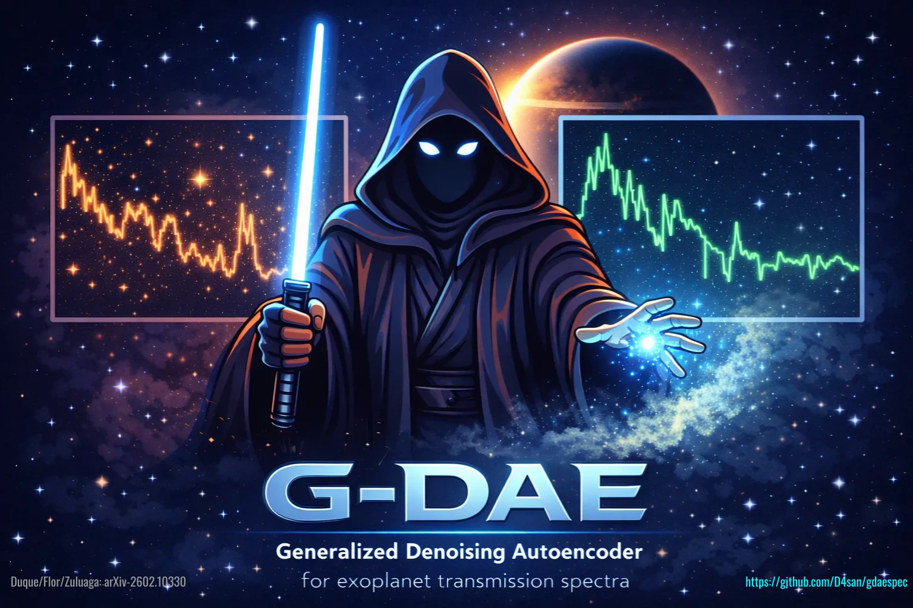

# G-DAESpec

[](LICENSE)
[](https://www.python.org/downloads/)
[](https://arxiv.org/abs/2602.10330)

<div align="center">
  
</div>

This repository accompanies the paper:

```bibtex
@misc{duque-castano2026gdaespec,
   title = {Efficient reduction of stellar contamination and noise in planetary transmission spectra using neural networks},
   author = {David S. Duque-Casta\~no and Lauren Flor-Torres and Jorge I. Zuluaga},
   year = {2026},
   eprint = {2602.10330},
   archivePrefix = {arXiv},
   primaryClass = {astro-ph.EP},
   doi = {10.48550/arXiv.2602.10330},
   url = {https://arxiv.org/abs/2602.10330}
}
```


The code tests a General Denoising AutoEncoder (G-DAE) for transmission
spectra affected by stellar contamination and observational noise. The project
is organized around the two experiments discussed in the paper:

1. `training-and-experiments/Earth_like_Atmosphere/`: TRAPPIST-1e analogue, including G-DAE training,
   uncertainty-aware reconstruction, SPHINX/PHOENIX stellar contamination
   checks, and POSEIDON retrieval tests.
2. `training-and-experiments/Sub_Neptune_Atmosphere/`: K2-18b analogue, including spectra generation,
   stellar contamination, autoencoder training, and evaluation.

The parameters of the trained models, as well as an example of how to use them,
are available in [model-parameters/](model-parameters/).

## Repository Map

| Path | Purpose |
| --- | --- |
| [training-and-experiments/Earth_like_Atmosphere/](training-and-experiments/Earth_like_Atmosphere/) | Main Earth-like/TRAPPIST-1e experiment. |
| [training-and-experiments/Earth_like_Atmosphere/Retrieval Tests/](training-and-experiments/Earth_like_Atmosphere/Retrieval%20Tests/) | POSEIDON five-observation retrieval campaign. |
| [training-and-experiments/Earth_like_Atmosphere/stellar_contamination/](training-and-experiments/Earth_like_Atmosphere/stellar_contamination/) | PHOENIX and SPHINX stellar-contamination curves used by the Earth-like workflow. |
| [training-and-experiments/Earth_like_Atmosphere/spec_data/](training-and-experiments/Earth_like_Atmosphere/spec_data/) | Earth-like spectral datasets derived from the referenced MultiREx example. |
| [training-and-experiments/Sub_Neptune_Atmosphere/](training-and-experiments/Sub_Neptune_Atmosphere/) | K2-18b/Sub-Neptune experiment. |
| [model-parameters/](model-parameters/) | Minimal notebooks and model files for applying trained G-DAE models. |

## Main Workflows

Recommended reading order:

1. Start with this README.
2. Open [model-parameters/G-DAE-Example.ipynb](model-parameters/G-DAE-Example.ipynb)
   for the shortest application-oriented workflow.
3. Open [training-and-experiments/Earth_like_Atmosphere/README.md](training-and-experiments/Earth_like_Atmosphere/README.md) for
   the TRAPPIST-1e case.
4. Open
   [training-and-experiments/Earth_like_Atmosphere/Retrieval Tests/README.md](training-and-experiments/Earth_like_Atmosphere/Retrieval%20Tests/README.md)
   for the retrieval validation workflow.
5. Open [training-and-experiments/Sub_Neptune_Atmosphere/README.md](training-and-experiments/Sub_Neptune_Atmosphere/README.md)
   for the K2-18b case.

### Earth-like atmosphere

Use [training-and-experiments/Earth_like_Atmosphere/README.md](training-and-experiments/Earth_like_Atmosphere/README.md) for the
local workflow. The shortest reading order is:

1. `01_G-DAE.ipynb`: data assembly and G-DAE training.
2. `02_G-DAE_Analysis.ipynb`: reconstruction, metric, and uncertainty analysis.
3. `Retrieval Tests/README.md`: POSEIDON retrieval campaign comparing G-DAE
   preprocessing with explicit stellar-contamination retrievals.

### Sub-Neptune atmosphere

Use [training-and-experiments/Sub_Neptune_Atmosphere/README.md](training-and-experiments/Sub_Neptune_Atmosphere/README.md). The
notebooks are numbered in execution order:

1. `01_Spectra_Generation.ipynb`
2. `02_Stellar_Contamination.ipynb`
3. `03_AE_Training.ipynb`
4. `04_G-DAE_Evaluation.ipynb`

## Environment

The notebooks and scripts are scientific workflows rather than a packaged
Python library. They require a Python/Jupyter environment with:

- Install dependencies from [requirements.txt](requirements.txt):
   `pip install -r requirements.txt`

- [MultiREx](https://github.com/D4san/MultiREx-public)
- [POSEIDON](https://github.com/MartianColonist/POSEIDON)
- [TauREx 3](https://github.com/ucl-exoplanets/TauREx3_public)
- TensorFlow/Keras
- PandExo/Pandeia
- NumPy, Pandas, SciPy, scikit-learn, Matplotlib, Seaborn
- MPI for the retrieval scripts

Large opacity tables and some external model grids may need to be installed or
downloaded outside the repository, depending on the experiment. The README files
inside each data folder describe the expected sources.

## Data and Generated Products

The repository includes compact source data, notebooks, trained models, and a
subset of retrieval products needed to inspect the paper workflow. Very large
opacity tables are intentionally ignored by `.gitignore` and should be restored
from their cited sources when rerunning the full spectral-generation steps.

The repository contents fall into three categories:

- **Inputs**: `spec_data/`, `stellar_contamination/`, `waves.txt`, opacity/CIA
  files, and PandExo input spectra.
- **Executable workflow**: numbered notebooks and Python/MPI scripts.
- **Generated products**: trained `.keras` models, `.npz` uncertainty archives,
  `POSEIDON_output/`, plots, logs, and campaign CSV summaries.

## License

This repository is released under the [MIT License](LICENSE).

Copyright (C) 2026-present Duque-Castaño, Zuluaga, and Flor-Torres.
