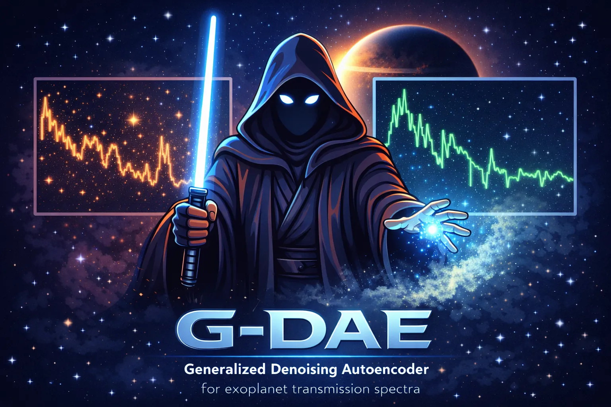

# G-DAESpec

[](LICENSE)
[](https://www.python.org/downloads/)
[](https://arxiv.org/abs/2602.10330)
[](https://github.com/D4san/MultiREx-public)
[](https://github.com/MartianColonist/POSEIDON)
[](https://github.com/ucl-exoplanets/TauREx3_public)

<div align="center">
  
</div>

## About

This repository contains the code and data accompanying the paper:

> **Efficient reduction of stellar contamination and noise in planetary transmission spectra using neural networks**
> Duque-Castaño, Zuluaga & Flor-Torres (2025)
> _Submitted to Astronomy & Astrophysics_
> [arXiv:2602.10330](https://arxiv.org/abs/2602.10330)

## Overview

**G-DAESpec** implements a **G-DAE** (General Denoising AutoEncoder) designed to correct the effects of stellar contamination and noise in exoplanet transmission spectra.

This work validates the G-DAE architecture using two distinct planetary cases:

1.  **Rocky Planets**: Using a **TRAPPIST-1e** analogue with an Earth-like atmosphere.
2.  **Sub-Neptunes**: Using a **K2-18b** analogue.

The project leverages the **MultiREx** library for spectral handling and **POSEIDON** for atmospheric retrieval and validation.

## Features

- **Stellar Contamination Correction**: Removes noise introduced by stellar spots and faculae to recover the true planetary spectrum.
- **Uncertainty-Aware Reconstruction**: The G-DAE provides reconstructed spectra together with their associated uncertainties, enabling seamless integration into Bayesian atmospheric retrieval pipelines.
- **Deep Learning Architecture**: Utilizes a Denoising AutoEncoder (DAE) trained on simulated datasets.
- **Broad Applicability**: Tested on both terrestrial and sub-Neptune atmospheric regimes.
- **Validation**: Results are verified against standard Bayesian atmospheric retrieval methods (Nested Sampling via POSEIDON).

## Repository Structure

```
gdaespec/
├── Earth_like_Atmosphere/          # Case 1: TRAPPIST-1e analogue
│   ├── 01_G-DAE.ipynb              # G-DAE training
│   ├── 02_G-DAE_Analysis.ipynb     # Performance analysis
│   ├── Models/                     # Trained G-DAE model (.keras)
│   ├── Retrieval Tests/            # POSEIDON retrieval experiments
│   ├── spec_data/                  # Spectral datasets
│   ├── stellar_contamination/      # Contamination factor files
│   └── ...
│
├── Sub_Neptune_Atmosphere/         # Case 2: K2-18b analogue
│   ├── 01_Spectra_Generation.ipynb # Synthetic spectral library
│   ├── 02_Stellar_Contamination.ipynb  # ε(λ) computation
│   ├── 03_AE_Training.ipynb        # G-DAE training
│   ├── 04_G-DAE_Evaluation.ipynb   # Model evaluation
│   ├── AE.keras                    # Trained model
│   ├── TLS/                        # Transit Light Source effect files
│   └── specs/                      # Generated spectra
│
├── Figures/                        # Figures and plots for the paper
├── LICENSE
└── README.md
```

Each case study directory contains its own `README.md` with detailed instructions.

## Requirements

The following key libraries are used in this project:

- **[MultiREx](https://github.com/D4san/MultiREx-public)**: For handling exoplanet spectra.
- **[POSEIDON](https://github.com/MartianColonist/POSEIDON)**: For atmospheric retrieval and spectra generation.
- **[TauREx 3](https://github.com/ucl-exoplanets/TauREx3_public)**: Bayesian retrieval framework.
- **TensorFlow / Keras**: For building and training the G-DAE models.
- **Pandeia / PandExo**: For JWST instrument noise simulation.
- **Scikit-learn, NumPy, Pandas, Matplotlib**: For data processing and visualization.

### Opacity Data & Chemical Species

This project utilizes opacity data and chemical species line lists from the following sources:

- **[ExoMol](https://www.exomol.com/)**: Molecular line lists for exoplanet and other hot atmospheres.
- **[ExoTransmit](https://github.com/elizakempton/Exo_Transmit)**: Transmission spectra calculation.

Please ensure to cite these works appropriately when using the data.

## License

[MIT License](LICENSE)
